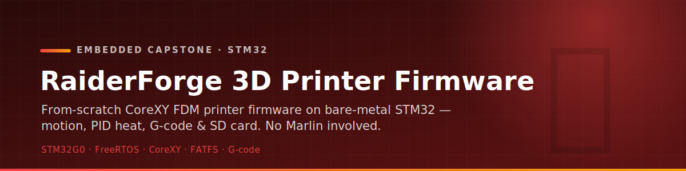
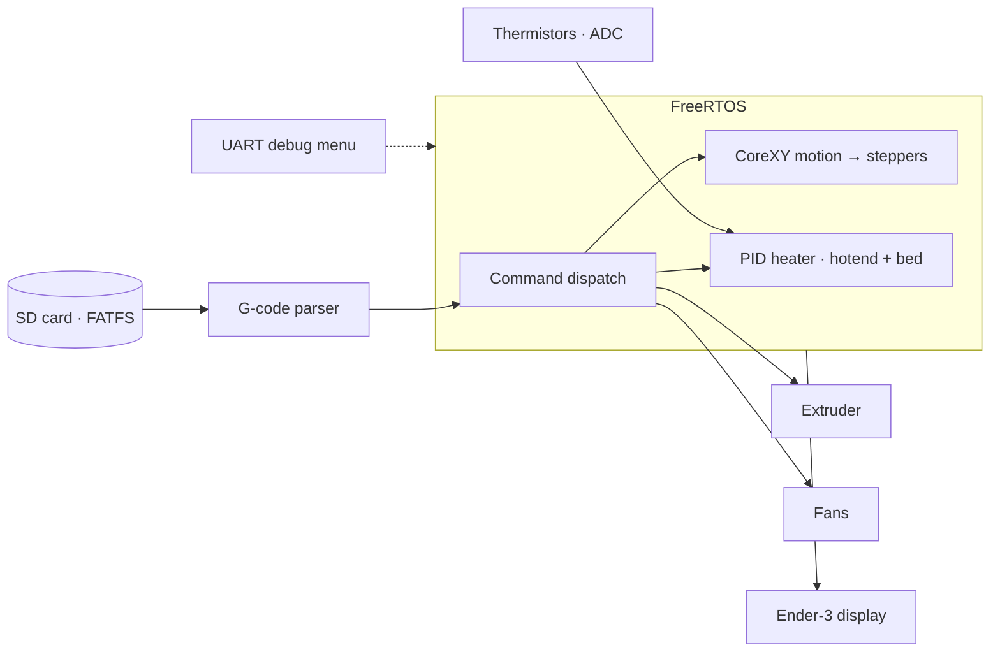

<p align="center">
  
</p>

<p align="center">
  
  
  
  
  
  
</p>

<p align="center">
  Custom firmware for a <b>fully scratch-built FDM 3D printer</b> — designed, assembled, and coded
  from the ground up. Runs on an STM32G0B1RET6 (Cortex-M0+) with CoreXY kinematics and a<br>
  direct-drive extruder: real-time motion, PID heat, G-code parsing, display and SD card. <b>No Marlin involved.</b>
</p>

<p align="center">
  <i>ECE 4380 — Embedded Systems Capstone, Texas Tech University · Dennis Rivera · Quinton Cook · Matthew Garcia</i>
</p>

---

## ✨ What it does

- 🧲 **CoreXY motion** — coordinated X/Y stepper motion with acceleration ramping; endstop-based
  homing for X, Y, Z.
- 🌡️ **PID heat control** — closed-loop hotend and heated-bed temperature regulation with
  thermistor feedback.
- 📄 **G-code engine** — parses G-code from the SD card and dispatches commands to motion, heat,
  extruder, and fans.
- 🧵 **Direct-drive extruder** — filament feed/retract with calibration routines.
- 🌀 **Fan control** — PWM part-cooling and hotend fans.
- 🖥️ **Display** — live telemetry (temperatures, position, print status) on an Ender-3-compatible screen.
- 💾 **SD card** — FATFS-based reads of G-code files.
- 🧩 **FreeRTOS** — multitasking architecture coordinating each subsystem concurrently, with an
  interactive UART debug/test menu for bring-up.

## 🏗 Architecture



## 🔌 Hardware

| Component | Detail |
| --------- | ------ |
| MCU | STM32G0B1RET6 (ARM Cortex-M0+) |
| Frame | Custom 2020 aluminum extrusion |
| Kinematics | CoreXY |
| Extruder | Direct drive |
| Bed | AC-to-DC heated bed + thermistor |
| Hotend | Standard FDM hotend + thermistor |
| Display | Ender 3 EXP3-compatible screen |
| Storage | microSD (FATFS middleware) |
| RTOS | FreeRTOS |

## 🗂 Project structure

```text
├── Core/
│   ├── Inc/                 # subsystem headers (motion, heater, parser, sdcard, …)
│   └── Src/
│       ├── main.c           # init + task creation
│       ├── motion.c         # CoreXY motion, acceleration, step generation
│       ├── heater.c / bed_heater.c   # PID heat control
│       ├── thermistor.c     # ADC → temperature
│       ├── homing.c         # endstop homing
│       ├── parser.c / gcodefuncs.c   # G-code parse + execute
│       ├── sdcard.c         # FATFS SD reads
│       ├── display.c        # Ender 3 screen
│       └── app_freertos.c   # FreeRTOS task definitions
├── Drivers/ · Middlewares/  # STM32 HAL + CMSIS, FreeRTOS + FATFS
├── QBC_RaiderForge_04_21_26.ioc   # CubeMX peripheral config
├── Makefile · STM32G0B1RETX_*.ld  # build + linker scripts
├── docs/                    # state-architecture diagrams (draw.io)
└── REFERENCES.md
```

## 🚀 Build & flash

**STM32CubeIDE** — import the project and build for the STM32G0B1RET6 target, then flash over ST-Link.

**Command line** (arm-none-eabi toolchain):

```bash
make                  # builds into Debug/
# flash the resulting .elf / .bin via ST-Link (e.g. STM32CubeProgrammer)
```

The interactive UART debug menu lets you exercise each subsystem (motion, heat, extruder, display)
individually during bring-up.

## 🧰 Stack

| Layer | Tech |
| ----- | ---- |
| MCU | STM32G0B1RET6 (Cortex-M0+) |
| Language | C (bare-metal + STM32 HAL) |
| RTOS | FreeRTOS |
| Storage | FATFS (microSD) |
| Motion | CoreXY, stepper drivers, acceleration ramping |
| Control | PID heat, thermistor ADC, PWM fans |
| Tooling | STM32CubeMX / CubeIDE, Makefile, arm-none-eabi |
