# RaiderForge State And Architecture Diagrams

These diagrams are written in Mermaid so they can be pasted into draw.io:

1. Open draw.io / diagrams.net.
2. Choose `Insert` -> `Advanced` -> `Mermaid`.
3. Paste one Mermaid block at a time.
4. Export as PNG/SVG and drop it into slides.

The diagrams below match the current code structure in `Core/Src` and `Core/Inc`.

---

## Copy-Paste Slide Wording

### Bed heater states

- **Bed Fault:** The bed heater enters this state if the thermistor is shorted/open, the temperature reading is invalid, or the bed exceeds safe thermal limits. PWM is forced off.
- **Cool Bed Heater:** This state occurs after a print completes, a print is canceled, or the bed target is lowered/off. The bed heater PWM stays off while telemetry continues.
- **Bed Heater Off / Idle:** The bed is initialized and waiting for a target temperature from G-code or the menu.
- **Preheat Bed:** The bed receives a target temperature from `M140`, `M190`, or the menu. The PID loop heats the bed toward the target.
- **Hold Bed Heater Temp:** The bed is at the target window and keeps running the PID loop to maintain temperature during printing.

### Nozzle and fan states

- **Nozzle Fault:** The hotend enters this state on thermal runaway, invalid thermistor readings, or sensor open/short. The heater is disabled.
- **Cool Nozzle Heater:** Used after print complete/cancel or nozzle target off. The heater is off, but the hotend fan stays on while the nozzle is still hot.
- **Nozzle Heater Idle:** The nozzle task is initialized and waiting for a target from G-code or the menu.
- **Preheat Nozzle:** The nozzle target comes from `M104`, `M109`, or the menu. The PID loop drives the nozzle heater until it reaches the target.
- **Hold Nozzle Heater Temp:** The nozzle is inside the target window and maintains temperature for printing.
- **Hotend Fan Auto:** The hotend fan turns on when nozzle temperature reaches 50 C and turns off only when the nozzle is below 45 C and the heater is disabled.
- **Part Cooling Fan:** The part fan is controlled by `M106`/`M107`; it is separate from the hotend safety fan.

### Motion, extruder, thermistor, and endstop states

- **Motion Idle:** Motion waits for a typed command from `xMotionQueue`.
- **Motion Move:** G0/G1 commands are converted into A/B CoreXY steps, Z steps, and synchronized E extruder steps.
- **Extruder Motor E:** The extruder computes E distance, applies flow percent, chooses extrude/retract direction, clamps step frequency, and drives TIM17 counted pulses.
- **Homing:** G28 runs fast approach, settle, backoff, slow approach, and final settle for X/Y/Z endstops.
- **Endstop Debounce:** Endstop readings must be stable for 10 ms before `triggered`, `just_triggered`, or `just_released` changes.
- **Thermistor Read:** The ADC channel is switched, one reading is discarded, 16 samples are filtered, and the result is converted to temperature.
- **Thermistor Fault:** Short, open, invalid resistance, or invalid temperature status is passed into the heater fault system.

---

## 1. Full Firmware Architecture

Use this as the high-level slide that explains how all tasks and modules work together.

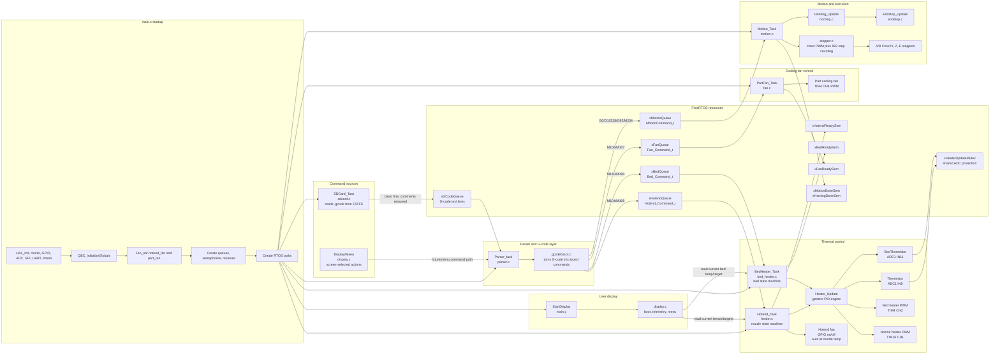
```mermaid
flowchart LR
    subgraph Startup["main.c startup"]
        HAL["HAL_Init, clocks, GPIO, ADC, SPI, UART, timers"]
        InitGlobals["QBC_InitializeGlobals"]
        InitFans["Fan_Init hotend_fan and part_fan"]
        RTOSResources["Create queues, semaphores, mutexes"]
        Threads["Create RTOS tasks"]
        HAL --> InitGlobals --> InitFans --> RTOSResources --> Threads
    end

    subgraph RTOS["FreeRTOS resources"]
        QG["xGCodeQueue<br/>G-code text lines"]
        QM["xMotionQueue<br/>MotionCommand_t"]
        QH["xHotendQueue<br/>Hotend_Command_t"]
        QB["xBedQueue<br/>Bed_Command_t"]
        QF["xFanQueue<br/>Fan_Command_t"]
        SH["xHotendReadySem"]
        SB["xBedReadySem"]
        SF["xFanReadySem"]
        SM["xMotionDoneSem<br/>xHomingDoneSem"]
        MH["xHeaterUpdateMutex<br/>shared ADC protection"]
    end

    subgraph Sources["Command sources"]
        SD["SDCard_Task<br/>sdcard.c<br/>reads .gcode from FATFS"]
        Screen["Display/Menu<br/>display.c<br/>screen-selected actions"]
    end

    subgraph ParserLayer["Parser and G-code layer"]
        Parser["Parser_task<br/>parser.c"]
        GFuncs["gcodefuncs.c<br/>turns G-code into typed commands"]
    end

    subgraph Thermal["Thermal control"]
        HotendTask["Hotend_Task<br/>heater.c<br/>nozzle state machine"]
        BedTask["BedHeater_Task<br/>bed_heater.c<br/>bed state machine"]
        PID["Heater_Update<br/>generic PID engine"]
        HotTherm["Thermistor<br/>ADC1 IN9"]
        BedTherm["BedThermistor<br/>ADC1 IN11"]
        HotFan["Hotend fan<br/>GPIO on/off<br/>auto at nozzle temp"]
        BedPWM["Bed heater PWM<br/>TIM4 CH2"]
        NozzlePWM["Nozzle heater PWM<br/>TIM16 CH1"]
    end

    subgraph FanLayer["Cooling fan control"]
        PartFanTask["PartFan_Task<br/>fan.c"]
        PartFan["Part cooling fan<br/>TIM4 CH4 PWM"]
    end

    subgraph MotionLayer["Motion and extrusion"]
        MotionTask["Motion_Task<br/>motion.c"]
        Homing["Homing_Update<br/>homing.c"]
        Endstops["Endstop_Update<br/>endstop.c"]
        StepperLayer["stepper.c<br/>timer PWM plus ISR step counting"]
        Motors["A/B CoreXY, Z, E steppers"]
    end

    subgraph DisplayLayer["User display"]
        DisplayTask["StartDisplay<br/>main.c"]
        UI["display.c<br/>boot, telemetry, menu"]
    end

    Threads --> SD
    Threads --> Parser
    Threads --> HotendTask
    Threads --> BedTask
    Threads --> PartFanTask
    Threads --> MotionTask
    Threads --> DisplayTask

    SD -->|"clean line, comments removed"| QG
    QG --> Parser
    Screen -. "future/menu command path" .-> Parser
    Parser --> GFuncs

    GFuncs -->|"G0/G1/G28/G92/M204"| QM
    GFuncs -->|"M104/M109"| QH
    GFuncs -->|"M140/M190"| QB
    GFuncs -->|"M106/M107"| QF

    QH --> HotendTask
    QB --> BedTask
    QF --> PartFanTask
    QM --> MotionTask

    HotendTask --> PID
    BedTask --> PID
    PID --> HotTherm
    PID --> BedTherm
    HotTherm --> MH
    BedTherm --> MH
    PID --> NozzlePWM
    PID --> BedPWM
    HotendTask --> HotFan
    HotendTask --> SH
    BedTask --> SB

    PartFanTask --> PartFan
    PartFanTask --> SF

    MotionTask --> Homing
    Homing --> Endstops
    MotionTask --> StepperLayer
    StepperLayer --> Motors
    MotionTask --> SM

    DisplayTask --> UI
    UI -->|"read current temps/targets"| HotendTask
    UI -->|"read current bed temp/target"| BedTask
```

---

## 2. RTOS Task And Queue Map

Use this when you want to explain how the firmware is split into tasks.

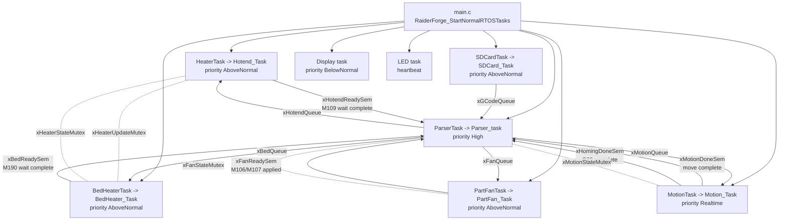
```mermaid
flowchart TB
    Main["main.c<br/>RaiderForge_StartNormalRTOSTasks"] --> Hotend["HeaterTask -> Hotend_Task<br/>priority AboveNormal"]
    Main --> Bed["BedHeaterTask -> BedHeater_Task<br/>priority AboveNormal"]
    Main --> Fan["PartFanTask -> PartFan_Task<br/>priority AboveNormal"]
    Main --> Motion["MotionTask -> Motion_Task<br/>priority Realtime"]
    Main --> SD["SDCardTask -> SDCard_Task<br/>priority AboveNormal"]
    Main --> Parser["ParserTask -> Parser_task<br/>priority High"]
    Main --> Display["Display task<br/>priority BelowNormal"]
    Main --> LED["LED task<br/>heartbeat"]

    SD -->|"xGCodeQueue"| Parser
    Parser -->|"xHotendQueue"| Hotend
    Parser -->|"xBedQueue"| Bed
    Parser -->|"xFanQueue"| Fan
    Parser -->|"xMotionQueue"| Motion

    Hotend -->|"xHotendReadySem<br/>M109 wait complete"| Parser
    Bed -->|"xBedReadySem<br/>M190 wait complete"| Parser
    Fan -->|"xFanReadySem<br/>M106/M107 applied"| Parser
    Motion -->|"xMotionDoneSem<br/>move complete"| Parser
    Motion -->|"xHomingDoneSem<br/>G28 complete"| Parser

    Hotend -. "xHeaterUpdateMutex" .- Bed
    Hotend -. "xHeaterStateMutex" .- Bed
    Fan -. "xFanStateMutex" .- Parser
    Motion -. "xMotionStateMutex" .- Parser
```

---

## 3. Bed Heater State Diagram

This mirrors your nozzle heater slide, but uses the actual bed task and PID loop.

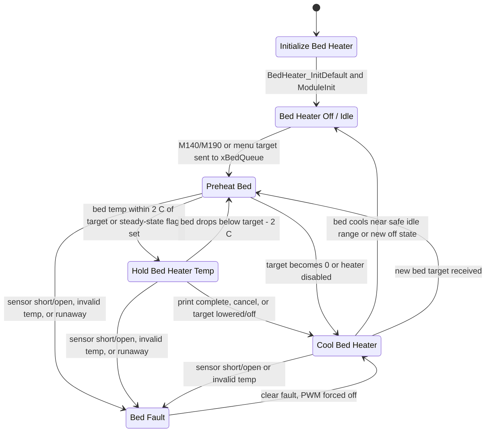
```mermaid
stateDiagram-v2
    [*] --> Initialize_Bed_Heater

    state "Initialize Bed Heater" as Initialize_Bed_Heater
    state "Bed Heater Off / Idle" as Bed_Idle
    state "Preheat Bed" as Preheat_Bed
    state "Hold Bed Heater Temp" as Hold_Bed
    state "Cool Bed Heater" as Cool_Bed
    state "Bed Fault" as Bed_Fault

    Initialize_Bed_Heater --> Bed_Idle : BedHeater_InitDefault and ModuleInit
    Bed_Idle --> Preheat_Bed : M140/M190 or menu target sent to xBedQueue
    Preheat_Bed --> Hold_Bed : bed temp within 2 C of target or steady-state flag set
    Hold_Bed --> Preheat_Bed : bed drops below target - 2 C
    Hold_Bed --> Cool_Bed : print complete, cancel, or target lowered/off
    Preheat_Bed --> Cool_Bed : target becomes 0 or heater disabled
    Cool_Bed --> Bed_Idle : bed cools near safe idle range or new off state
    Cool_Bed --> Preheat_Bed : new bed target received

    Preheat_Bed --> Bed_Fault : sensor short/open, invalid temp, or runaway
    Hold_Bed --> Bed_Fault : sensor short/open, invalid temp, or runaway
    Cool_Bed --> Bed_Fault : sensor short/open or invalid temp
    Bed_Fault --> Cool_Bed : clear fault, PWM forced off
```

---

## 4. Bed PID Control Loop

This is the inner loop running inside `BedHeater_Task` through `Heater_Update()`.

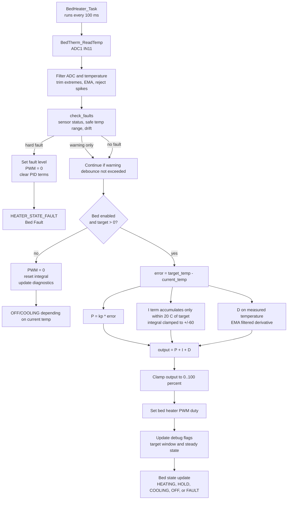
```mermaid
flowchart TD
    Tick["BedHeater_Task<br/>runs every 100 ms"] --> Read["BedTherm_ReadTemp<br/>ADC1 IN11"]
    Read --> Filter["Filter ADC and temperature<br/>trim extremes, EMA, reject spikes"]
    Filter --> FaultCheck["check_faults<br/>sensor status, safe temp range, drift"]

    FaultCheck -->|"hard fault"| Fault["Set fault level<br/>PWM = 0<br/>clear PID terms"]
    Fault --> StateFault["HEATER_STATE_FAULT<br/>Bed Fault"]

    FaultCheck -->|"warning only"| Continue["Continue if warning debounce not exceeded"]
    FaultCheck -->|"no fault"| Continue

    Continue --> Enabled{"Bed enabled<br/>and target > 0?"}
    Enabled -->|"no"| Off["PWM = 0<br/>reset integral<br/>update diagnostics"]
    Off --> StateCool["OFF/COOLING depending on current temp"]

    Enabled -->|"yes"| Error["error = target_temp - current_temp"]
    Error --> P["P = kp * error"]
    Error --> I["I term accumulates only within 20 C of target<br/>integral clamped to +/-60"]
    Error --> D["D on measured temperature<br/>EMA filtered derivative"]
    P --> Sum["output = P + I + D"]
    I --> Sum
    D --> Sum
    Sum --> Clamp["Clamp output to 0..100 percent"]
    Clamp --> PWM["Set bed heater PWM duty"]
    PWM --> Flags["Update debug flags<br/>target window and steady state"]
    Flags --> BedState["Bed state update<br/>HEATING, HOLD, COOLING, OFF, or FAULT"]
```

---

## 5. Nozzle Heater And Hotend Fan State Diagram

This keeps your existing nozzle diagram style, but adds the current fan behavior.

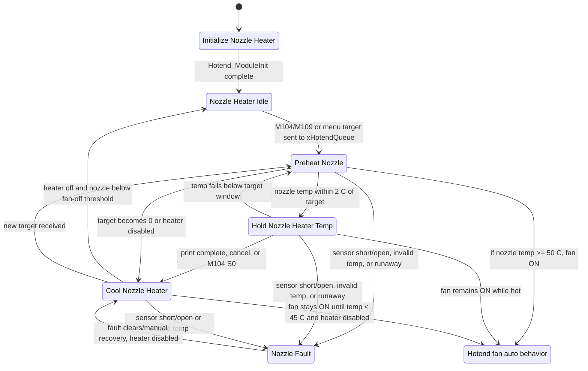
```mermaid
stateDiagram-v2
    [*] --> Initialize_Nozzle_Heater

    state "Initialize Nozzle Heater" as Initialize_Nozzle_Heater
    state "Nozzle Heater Idle" as Nozzle_Idle
    state "Preheat Nozzle" as Preheat_Nozzle
    state "Hold Nozzle Heater Temp" as Hold_Nozzle
    state "Cool Nozzle Heater" as Cool_Nozzle
    state "Nozzle Fault" as Nozzle_Fault

    Initialize_Nozzle_Heater --> Nozzle_Idle : Hotend_ModuleInit complete
    Nozzle_Idle --> Preheat_Nozzle : M104/M109 or menu target sent to xHotendQueue
    Preheat_Nozzle --> Hold_Nozzle : nozzle temp within 2 C of target
    Hold_Nozzle --> Preheat_Nozzle : temp falls below target window
    Hold_Nozzle --> Cool_Nozzle : print complete, cancel, or M104 S0
    Preheat_Nozzle --> Cool_Nozzle : target becomes 0 or heater disabled
    Cool_Nozzle --> Nozzle_Idle : heater off and nozzle below fan-off threshold
    Cool_Nozzle --> Preheat_Nozzle : new target received

    Preheat_Nozzle --> Nozzle_Fault : sensor short/open, invalid temp, or runaway
    Hold_Nozzle --> Nozzle_Fault : sensor short/open, invalid temp, or runaway
    Cool_Nozzle --> Nozzle_Fault : sensor short/open or invalid temp
    Nozzle_Fault --> Cool_Nozzle : fault clears/manual recovery, heater disabled

    state "Hotend fan auto behavior" as HotendFan
    Preheat_Nozzle --> HotendFan : if nozzle temp >= 50 C, fan ON
    Hold_Nozzle --> HotendFan : fan remains ON while hot
    Cool_Nozzle --> HotendFan : fan stays ON until temp < 45 C and heater disabled
```

---

## 6. Shared Heater Fault System

Use this to explain why both bed and nozzle faults go to a safe shutdown.

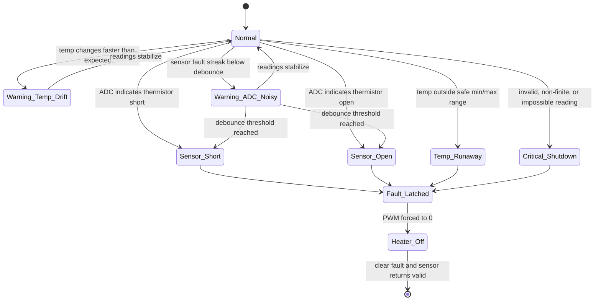
```mermaid
stateDiagram-v2
    [*] --> Normal

    Normal --> Warning_Temp_Drift : temp changes faster than expected
    Normal --> Warning_ADC_Noisy : sensor fault streak below debounce
    Warning_Temp_Drift --> Normal : readings stabilize
    Warning_ADC_Noisy --> Normal : readings stabilize

    Normal --> Sensor_Short : ADC indicates thermistor short
    Normal --> Sensor_Open : ADC indicates thermistor open
    Normal --> Temp_Runaway : temp outside safe min/max range
    Normal --> Critical_Shutdown : invalid, non-finite, or impossible reading

    Warning_ADC_Noisy --> Sensor_Short : debounce threshold reached
    Warning_ADC_Noisy --> Sensor_Open : debounce threshold reached

    Sensor_Short --> Fault_Latched
    Sensor_Open --> Fault_Latched
    Temp_Runaway --> Fault_Latched
    Critical_Shutdown --> Fault_Latched

    Fault_Latched --> Heater_Off : PWM forced to 0
    Heater_Off --> [*] : clear fault and sensor returns valid
```

---

## 7. Thermistor State Diagram

This covers both thermistor modules. Hotend uses `thermistor.c`; bed uses `bed_thermistor.c`.

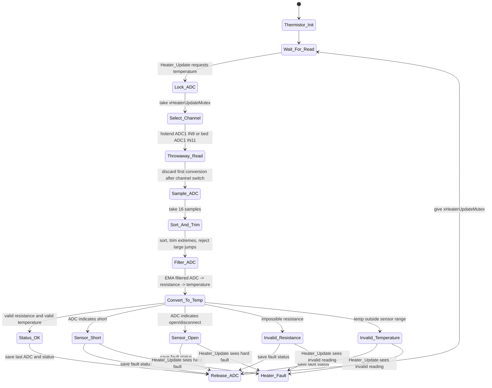
```mermaid
stateDiagram-v2
    [*] --> Thermistor_Init
    Thermistor_Init --> Wait_For_Read

    Wait_For_Read --> Lock_ADC : Heater_Update requests temperature
    Lock_ADC --> Select_Channel : take xHeaterUpdateMutex
    Select_Channel --> Throwaway_Read : hotend ADC1 IN9 or bed ADC1 IN11
    Throwaway_Read --> Sample_ADC : discard first conversion after channel switch
    Sample_ADC --> Sort_And_Trim : take 16 samples
    Sort_And_Trim --> Filter_ADC : sort, trim extremes, reject large jumps
    Filter_ADC --> Convert_To_Temp : EMA filtered ADC -> resistance -> temperature

    Convert_To_Temp --> Status_OK : valid resistance and valid temperature
    Convert_To_Temp --> Sensor_Short : ADC indicates short
    Convert_To_Temp --> Sensor_Open : ADC indicates open/disconnect
    Convert_To_Temp --> Invalid_Resistance : impossible resistance
    Convert_To_Temp --> Invalid_Temperature : temp outside sensor range

    Status_OK --> Release_ADC : save last ADC and status
    Sensor_Short --> Release_ADC : save fault status
    Sensor_Open --> Release_ADC : save fault status
    Invalid_Resistance --> Release_ADC : save fault status
    Invalid_Temperature --> Release_ADC : save fault status

    Release_ADC --> Wait_For_Read : give xHeaterUpdateMutex

    Sensor_Short --> Heater_Fault : Heater_Update sees hard fault
    Sensor_Open --> Heater_Fault : Heater_Update sees hard fault
    Invalid_Resistance --> Heater_Fault : Heater_Update sees invalid reading
    Invalid_Temperature --> Heater_Fault : Heater_Update sees invalid reading
```

---

## 8. Part Cooling Fan State Diagram

This represents `PartFan_Task` and `M106/M107` behavior.

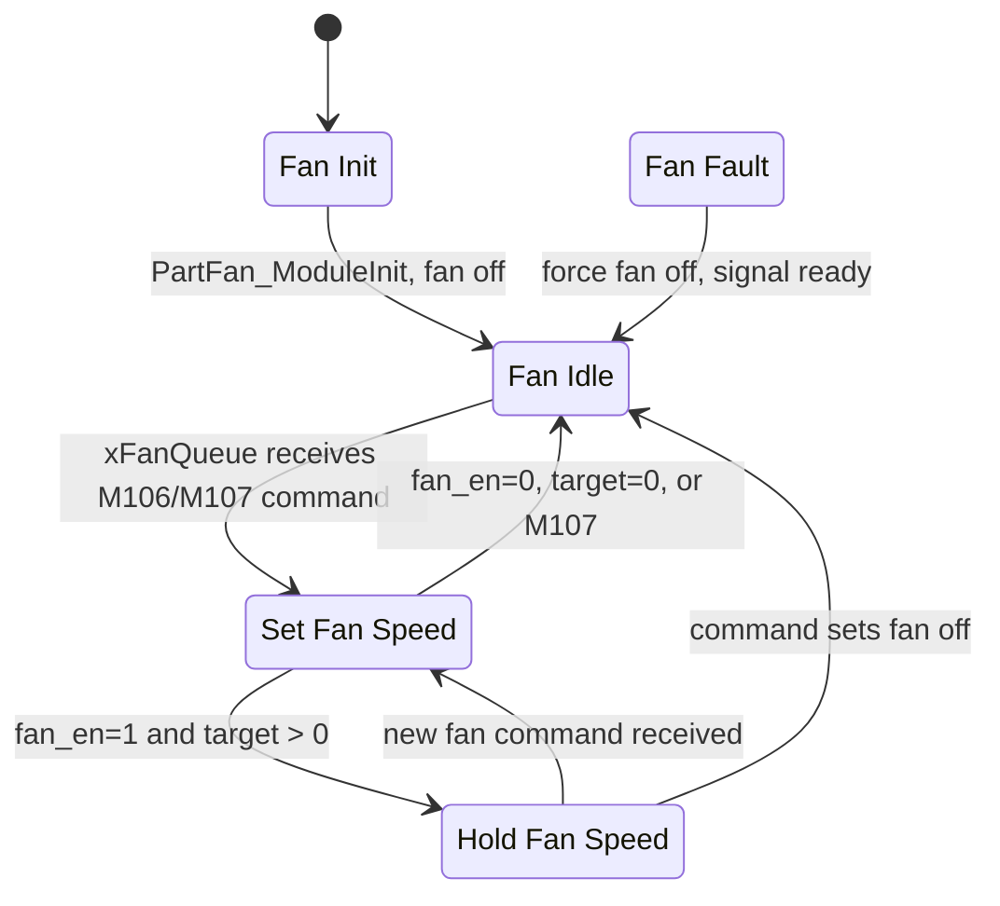
```mermaid
stateDiagram-v2
    [*] --> Fan_Init

    state "Fan Init" as Fan_Init
    state "Fan Idle" as Fan_Idle
    state "Set Fan Speed" as Fan_Set
    state "Hold Fan Speed" as Fan_Hold
    state "Fan Fault" as Fan_Fault

    Fan_Init --> Fan_Idle : PartFan_ModuleInit, fan off
    Fan_Idle --> Fan_Set : xFanQueue receives M106/M107 command
    Fan_Set --> Fan_Hold : fan_en=1 and target > 0
    Fan_Set --> Fan_Idle : fan_en=0, target=0, or M107
    Fan_Hold --> Fan_Set : new fan command received
    Fan_Hold --> Fan_Idle : command sets fan off
    Fan_Fault --> Fan_Idle : force fan off, signal ready
```

---

## 9. Hotend Fan Auto Behavior

This is separate from the part cooling fan. It is controlled inside the hotend task.

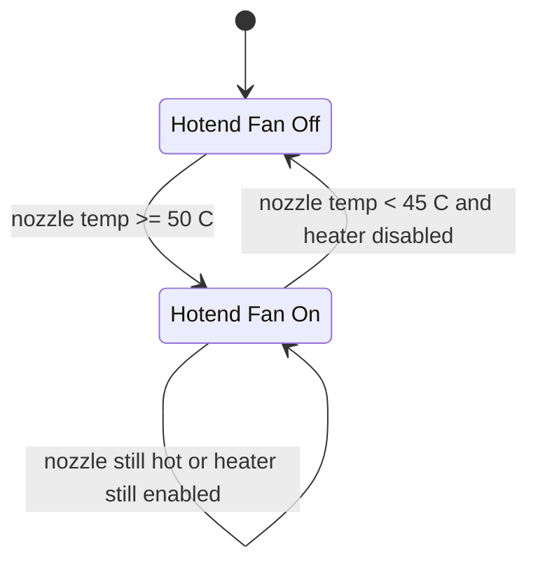
```mermaid
stateDiagram-v2
    [*] --> Hotend_Fan_Off

    state "Hotend Fan Off" as Hotend_Fan_Off
    state "Hotend Fan On" as Hotend_Fan_On

    Hotend_Fan_Off --> Hotend_Fan_On : nozzle temp >= 50 C
    Hotend_Fan_On --> Hotend_Fan_Off : nozzle temp < 45 C and heater disabled
    Hotend_Fan_On --> Hotend_Fan_On : nozzle still hot or heater still enabled
```

---

## 10. Motion And Extruder State Diagram

This shows XY, Z, and E motor behavior in `Motion_Task`.

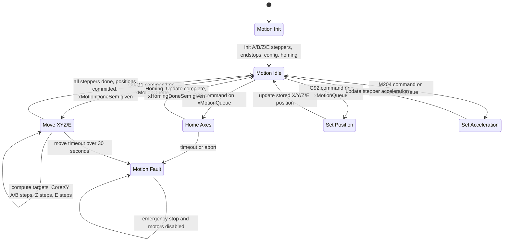
```mermaid
stateDiagram-v2
    [*] --> Motion_Init

    state "Motion Init" as Motion_Init
    state "Motion Idle" as Motion_Idle
    state "Home Axes" as Motion_Home
    state "Move XYZ/E" as Motion_Move
    state "Set Position" as Motion_Set_Pos
    state "Set Acceleration" as Motion_Set_Accel
    state "Motion Fault" as Motion_Fault

    Motion_Init --> Motion_Idle : init A/B/Z/E steppers, endstops, config, homing

    Motion_Idle --> Motion_Home : G28 command on xMotionQueue
    Motion_Idle --> Motion_Move : G0/G1 command on xMotionQueue
    Motion_Idle --> Motion_Set_Pos : G92 command on xMotionQueue
    Motion_Idle --> Motion_Set_Accel : M204 command on xMotionQueue

    Motion_Home --> Motion_Idle : Homing_Update complete, xHomingDoneSem given
    Motion_Home --> Motion_Fault : timeout or abort

    Motion_Move --> Motion_Move : compute targets, CoreXY A/B steps, Z steps, E steps
    Motion_Move --> Motion_Idle : all steppers done, positions committed, xMotionDoneSem given
    Motion_Move --> Motion_Fault : move timeout over 30 seconds

    Motion_Set_Pos --> Motion_Idle : update stored X/Y/Z/E position
    Motion_Set_Accel --> Motion_Idle : update stepper acceleration

    Motion_Fault --> Motion_Fault : emergency stop and motors disabled
```

---

## 11. Extruder Motor E Planning

Use this when you need to explain the extruder update specifically.

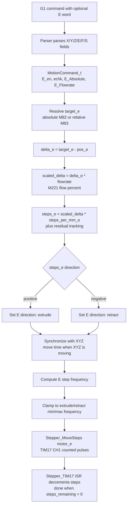
```mermaid
flowchart TD
    G1["G1 command with optional E word"] --> Parser["Parser parses X/Y/Z/E/F/S fields"]
    Parser --> MotionCmd["MotionCommand_t<br/>E_en, echk, E_Absolute, E_Flowrate"]
    MotionCmd --> Resolve["Resolve target_e<br/>absolute M82 or relative M83"]
    Resolve --> Delta["delta_e = target_e - pos_e"]
    Delta --> Flow["scaled_delta = delta_e * flowrate<br/>M221 flow percent"]
    Flow --> Steps["steps_e = scaled_delta * steps_per_mm_e<br/>plus residual tracking"]
    Steps --> Dir{"steps_e direction"}
    Dir -->|"positive"| Extrude["Set E direction: extrude"]
    Dir -->|"negative"| Retract["Set E direction: retract"]
    Extrude --> Sync
    Retract --> Sync
    Sync["Synchronize with XYZ move time when XYZ is moving"] --> Freq["Compute E step frequency"]
    Freq --> Clamp["Clamp to extrude/retract min/max frequency"]
    Clamp --> MoveE["Stepper_MoveSteps motor_e<br/>TIM17 CH1 counted pulses"]
    MoveE --> Done["Stepper_TIM17 ISR decrements steps<br/>done when steps_remaining = 0"]
```

---

## 12. Stepper Driver State Diagram

This represents `stepper.c` for A, B, Z, and E motors.

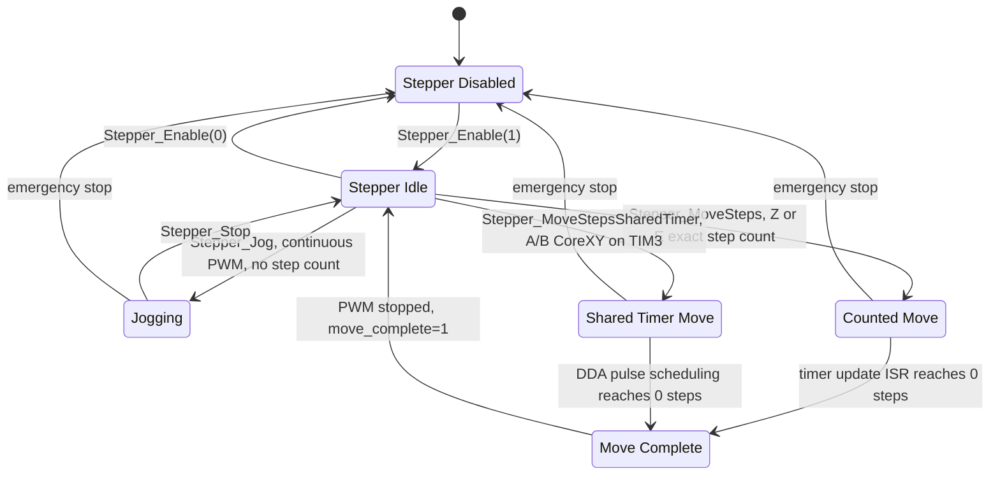
```mermaid
stateDiagram-v2
    [*] --> Stepper_Disabled

    state "Stepper Disabled" as Stepper_Disabled
    state "Stepper Idle" as Stepper_Idle
    state "Jogging" as Jogging
    state "Counted Move" as Counted_Move
    state "Shared Timer Move" as Shared_Timer_Move
    state "Move Complete" as Move_Complete

    Stepper_Disabled --> Stepper_Idle : Stepper_Enable(1)
    Stepper_Idle --> Stepper_Disabled : Stepper_Enable(0)

    Stepper_Idle --> Jogging : Stepper_Jog, continuous PWM, no step count
    Jogging --> Stepper_Idle : Stepper_Stop

    Stepper_Idle --> Counted_Move : Stepper_MoveSteps, Z or E exact step count
    Counted_Move --> Move_Complete : timer update ISR reaches 0 steps

    Stepper_Idle --> Shared_Timer_Move : Stepper_MoveStepsSharedTimer, A/B CoreXY on TIM3
    Shared_Timer_Move --> Move_Complete : DDA pulse scheduling reaches 0 steps

    Move_Complete --> Stepper_Idle : PWM stopped, move_complete=1
    Counted_Move --> Stepper_Disabled : emergency stop
    Shared_Timer_Move --> Stepper_Disabled : emergency stop
    Jogging --> Stepper_Disabled : emergency stop
```

---

## 13. Homing State Diagram

This is the expanded homing state machine driven by `Homing_Update`.

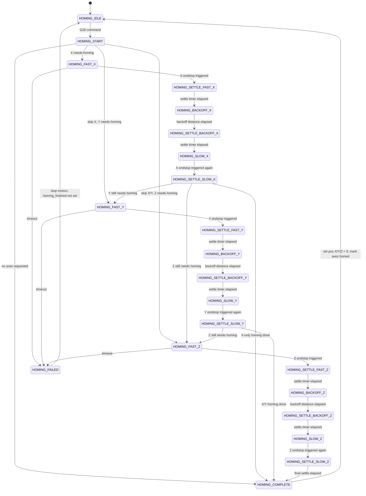
```mermaid
stateDiagram-v2
    [*] --> HOMING_IDLE
    HOMING_IDLE --> HOMING_START : G28 command

    HOMING_START --> HOMING_FAST_X : X needs homing
    HOMING_START --> HOMING_FAST_Y : skip X, Y needs homing
    HOMING_START --> HOMING_FAST_Z : skip X/Y, Z needs homing
    HOMING_START --> HOMING_COMPLETE : no axes requested

    HOMING_FAST_X --> HOMING_SETTLE_FAST_X : X endstop triggered
    HOMING_SETTLE_FAST_X --> HOMING_BACKOFF_X : settle timer elapsed
    HOMING_BACKOFF_X --> HOMING_SETTLE_BACKOFF_X : backoff distance elapsed
    HOMING_SETTLE_BACKOFF_X --> HOMING_SLOW_X : settle timer elapsed
    HOMING_SLOW_X --> HOMING_SETTLE_SLOW_X : X endstop triggered again
    HOMING_SETTLE_SLOW_X --> HOMING_FAST_Y : Y still needs homing
    HOMING_SETTLE_SLOW_X --> HOMING_FAST_Z : Z still needs homing
    HOMING_SETTLE_SLOW_X --> HOMING_COMPLETE : X-only homing done

    HOMING_FAST_Y --> HOMING_SETTLE_FAST_Y : Y endstop triggered
    HOMING_SETTLE_FAST_Y --> HOMING_BACKOFF_Y : settle timer elapsed
    HOMING_BACKOFF_Y --> HOMING_SETTLE_BACKOFF_Y : backoff distance elapsed
    HOMING_SETTLE_BACKOFF_Y --> HOMING_SLOW_Y : settle timer elapsed
    HOMING_SLOW_Y --> HOMING_SETTLE_SLOW_Y : Y endstop triggered again
    HOMING_SETTLE_SLOW_Y --> HOMING_FAST_Z : Z still needs homing
    HOMING_SETTLE_SLOW_Y --> HOMING_COMPLETE : X/Y homing done

    HOMING_FAST_Z --> HOMING_SETTLE_FAST_Z : Z endstop triggered
    HOMING_SETTLE_FAST_Z --> HOMING_BACKOFF_Z : settle timer elapsed
    HOMING_BACKOFF_Z --> HOMING_SETTLE_BACKOFF_Z : backoff distance elapsed
    HOMING_SETTLE_BACKOFF_Z --> HOMING_SLOW_Z : settle timer elapsed
    HOMING_SLOW_Z --> HOMING_SETTLE_SLOW_Z : Z endstop triggered again
    HOMING_SETTLE_SLOW_Z --> HOMING_COMPLETE : final settle elapsed

    HOMING_COMPLETE --> HOMING_IDLE : set pos X/Y/Z = 0, mark axes homed

    HOMING_FAST_X --> HOMING_FAILED : timeout
    HOMING_FAST_Y --> HOMING_FAILED : timeout
    HOMING_FAST_Z --> HOMING_FAILED : timeout
    HOMING_FAILED --> HOMING_IDLE : stop motors, homing_finished not set
```

---

## 14. Endstop Debounce State Diagram

This represents `Endstop_Update`.

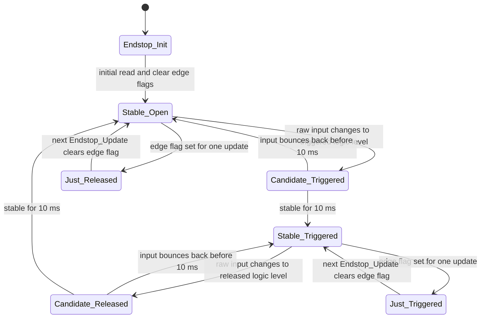
```mermaid
stateDiagram-v2
    [*] --> Endstop_Init
    Endstop_Init --> Stable_Open : initial read and clear edge flags

    Stable_Open --> Candidate_Triggered : raw input changes to triggered logic level
    Candidate_Triggered --> Stable_Open : input bounces back before 10 ms
    Candidate_Triggered --> Stable_Triggered : stable for 10 ms

    Stable_Triggered --> Candidate_Released : raw input changes to released logic level
    Candidate_Released --> Stable_Triggered : input bounces back before 10 ms
    Candidate_Released --> Stable_Open : stable for 10 ms

    Stable_Triggered --> Just_Triggered : edge flag set for one update
    Stable_Open --> Just_Released : edge flag set for one update

    Just_Triggered --> Stable_Triggered : next Endstop_Update clears edge flag
    Just_Released --> Stable_Open : next Endstop_Update clears edge flag
```

---

## 15. SD Card And Parser State Diagram

This explains how a print file becomes G-code commands.

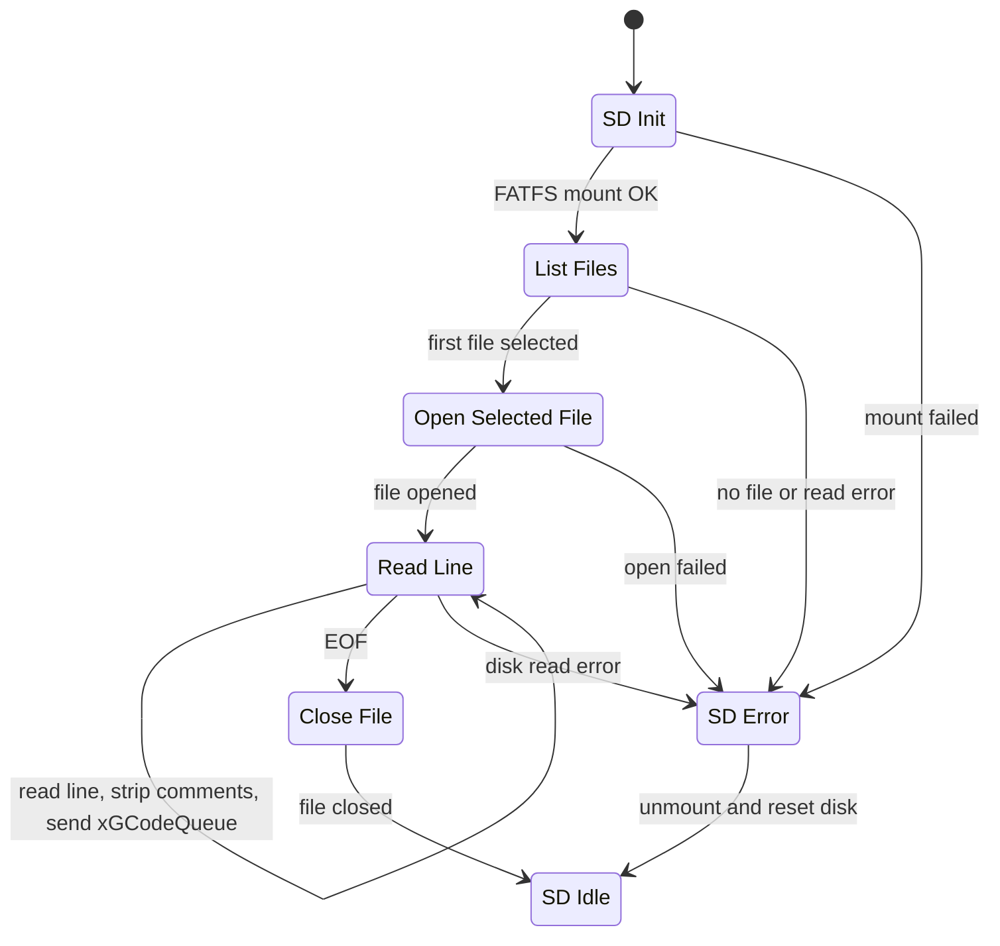
```mermaid
stateDiagram-v2
    [*] --> SD_Init

    state "SD Init" as SD_Init
    state "List Files" as SD_List
    state "Open Selected File" as SD_Open
    state "Read Line" as SD_Read
    state "Close File" as SD_Close
    state "SD Idle" as SD_Idle
    state "SD Error" as SD_Error

    SD_Init --> SD_List : FATFS mount OK
    SD_Init --> SD_Error : mount failed
    SD_List --> SD_Open : first file selected
    SD_List --> SD_Error : no file or read error
    SD_Open --> SD_Read : file opened
    SD_Open --> SD_Error : open failed
    SD_Read --> SD_Read : read line, strip comments, send xGCodeQueue
    SD_Read --> SD_Close : EOF
    SD_Read --> SD_Error : disk read error
    SD_Close --> SD_Idle : file closed
    SD_Error --> SD_Idle : unmount and reset disk
```

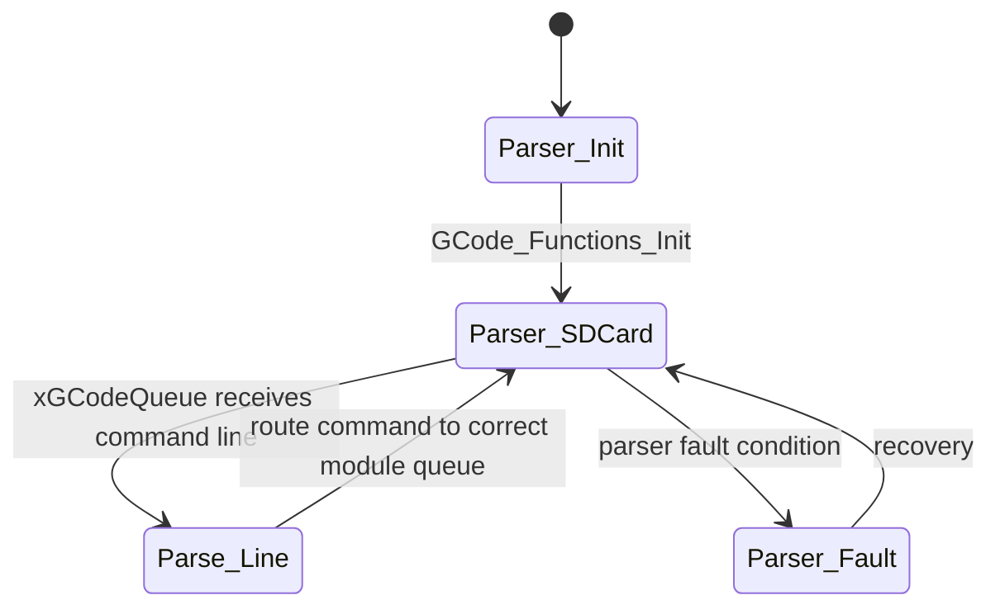
```mermaid
stateDiagram-v2
    [*] --> Parser_Init
    Parser_Init --> Parser_SDCard : GCode_Functions_Init
    Parser_SDCard --> Parse_Line : xGCodeQueue receives command line
    Parse_Line --> Parser_SDCard : route command to correct module queue
    Parser_SDCard --> Parser_Fault : parser fault condition
    Parser_Fault --> Parser_SDCard : recovery
```

---

## 16. G-code Routing Diagram

This is useful for a code architecture slide.

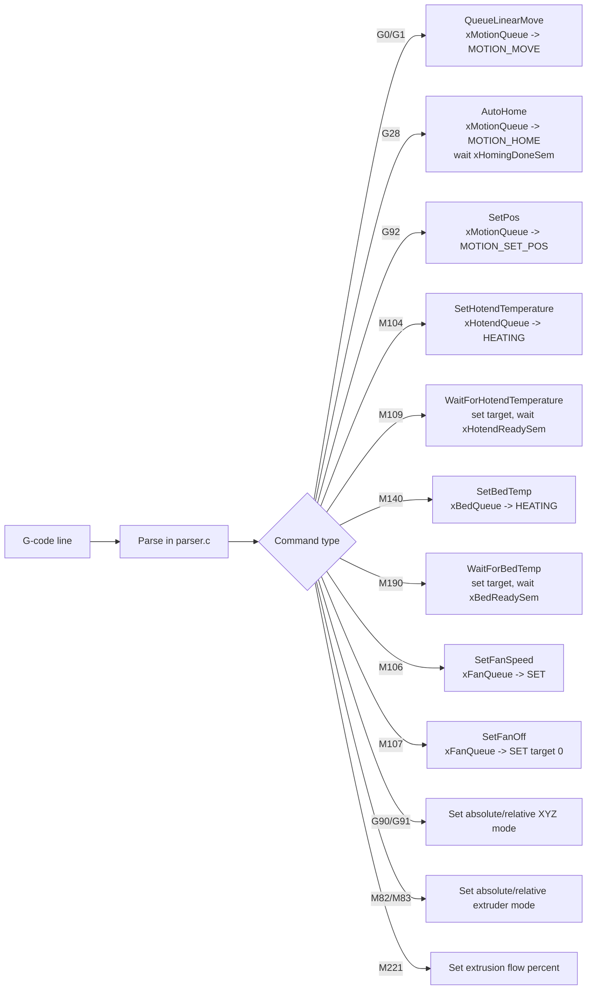
```mermaid
flowchart LR
    Line["G-code line"] --> Parse["Parse in parser.c"]
    Parse --> Route{"Command type"}

    Route -->|"G0/G1"| Linear["QueueLinearMove<br/>xMotionQueue -> MOTION_MOVE"]
    Route -->|"G28"| Home["AutoHome<br/>xMotionQueue -> MOTION_HOME<br/>wait xHomingDoneSem"]
    Route -->|"G92"| SetPos["SetPos<br/>xMotionQueue -> MOTION_SET_POS"]
    Route -->|"M104"| HotendSet["SetHotendTemperature<br/>xHotendQueue -> HEATING"]
    Route -->|"M109"| HotendWait["WaitForHotendTemperature<br/>set target, wait xHotendReadySem"]
    Route -->|"M140"| BedSet["SetBedTemp<br/>xBedQueue -> HEATING"]
    Route -->|"M190"| BedWait["WaitForBedTemp<br/>set target, wait xBedReadySem"]
    Route -->|"M106"| FanSet["SetFanSpeed<br/>xFanQueue -> SET"]
    Route -->|"M107"| FanOff["SetFanOff<br/>xFanQueue -> SET target 0"]
    Route -->|"G90/G91"| XYMode["Set absolute/relative XYZ mode"]
    Route -->|"M82/M83"| EMode["Set absolute/relative extruder mode"]
    Route -->|"M221"| Flow["Set extrusion flow percent"]
```

---

## 17. Display State Diagram

This matches the intended display behavior from `display.c` and your current slide.

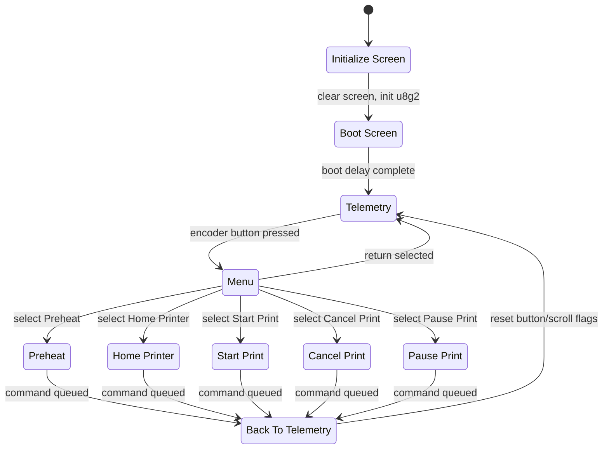
```mermaid
stateDiagram-v2
    [*] --> Initialize_Screen

    state "Initialize Screen" as Initialize_Screen
    state "Boot Screen" as Boot_Screen
    state "Telemetry" as Telemetry
    state "Menu" as Menu
    state "Preheat" as Preheat
    state "Home Printer" as Home
    state "Start Print" as Start_Print
    state "Cancel Print" as Cancel_Print
    state "Pause Print" as Pause_Print
    state "Back To Telemetry" as Back_To_Telemetry

    Initialize_Screen --> Boot_Screen : clear screen, init u8g2
    Boot_Screen --> Telemetry : boot delay complete
    Telemetry --> Menu : encoder button pressed
    Menu --> Telemetry : return selected

    Menu --> Preheat : select Preheat
    Menu --> Home : select Home Printer
    Menu --> Start_Print : select Start Print
    Menu --> Cancel_Print : select Cancel Print
    Menu --> Pause_Print : select Pause Print

    Preheat --> Back_To_Telemetry : command queued
    Home --> Back_To_Telemetry : command queued
    Start_Print --> Back_To_Telemetry : command queued
    Cancel_Print --> Back_To_Telemetry : command queued
    Pause_Print --> Back_To_Telemetry : command queued
    Back_To_Telemetry --> Telemetry : reset button/scroll flags
```

---

## 18. Print Lifecycle Diagram

Use this as a single "what happens during a print" slide.

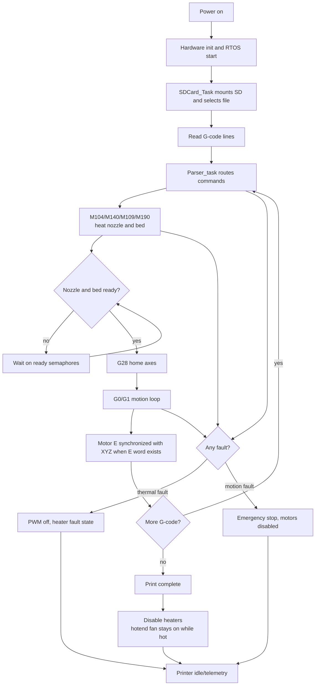
```mermaid
flowchart TD
    Start["Power on"] --> Init["Hardware init and RTOS start"]
    Init --> SD["SDCard_Task mounts SD and selects file"]
    SD --> Lines["Read G-code lines"]
    Lines --> Parser["Parser_task routes commands"]

    Parser --> Preheat["M104/M140/M109/M190<br/>heat nozzle and bed"]
    Preheat --> Ready{"Nozzle and bed ready?"}
    Ready -->|"no"| Wait["Wait on ready semaphores"]
    Wait --> Ready
    Ready -->|"yes"| Home["G28 home axes"]
    Home --> MoveLoop["G0/G1 motion loop"]
    MoveLoop --> Extrude["Motor E synchronized with XYZ when E word exists"]
    Extrude --> More{"More G-code?"}
    More -->|"yes"| Parser
    More -->|"no"| Finish["Print complete"]

    Finish --> Cool["Disable heaters<br/>hotend fan stays on while hot"]
    Cool --> Idle["Printer idle/telemetry"]

    Parser --> Fault{"Any fault?"}
    Preheat --> Fault
    MoveLoop --> Fault
    Fault -->|"thermal fault"| ThermalStop["PWM off, heater fault state"]
    Fault -->|"motion fault"| MotionStop["Emergency stop, motors disabled"]
    ThermalStop --> Idle
    MotionStop --> Idle
```
